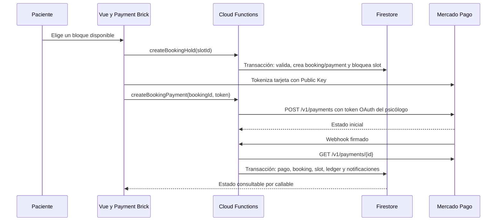

# Arquitectura de pagos marketplace

## Flujo principal

## Capas

`Vue -> paymentService -> Functions handlers -> MarketplacePaymentService -> MarketplacePaymentProvider -> MercadoPago/Fake`

La lógica de precio, comisión, estado e idempotencia no vive en componentes. El proveedor normaliza sus respuestas antes de llegar al dominio.

## OAuth

El backend genera 32 bytes aleatorios, conserva únicamente su SHA-256 en `payment_oauth_states` y acepta cada estado una vez durante diez minutos. Los tokens OAuth se cifran con AES-256-GCM y se guardan en `payment_account_secrets`, colección inaccesible para clientes. El callback nunca devuelve tokens al navegador.

## Modelo de datos

- `payment_accounts`: estado público limitado de conexión.
- `payment_account_secrets`: tokens cifrados; solo Admin SDK.
- `payment_oauth_states`: estados OAuth de corta duración.
- `bookings`: reserva, hold y estado de cita pagada.
- `payments`: importe, split, proveedor y estado financiero.
- `payment_attempts`: reintentos con clave idempotente propia.
- `payment_events`: recepción y procesamiento deduplicado.
- `commission_rules`: regla versionada; cada pago conserva un snapshot.
- `ledger_entries`: registro operativo inmutable.
- `refunds`: solicitud y resultado de reembolso.

Al aprobarse el pago, el backend reutiliza la terapia activa del paciente con
ese psicólogo o crea una nueva terapia compatible con el modelo histórico. La
cita confirmada se proyecta tanto en `citas` como en el arreglo resumido de
`terapias.citas`; un conflicto con otra terapia activa pasa a revisión manual.

## Dinero y split

Todos los importes son enteros en céntimos. El psicólogo se calcula primero con redondeo hacia abajo; el remanente pertenece a plataforma. La comisión del procesador se aplica al neto de plataforma en el ledger.

Mercado Pago documenta que en Split 1:1 la comisión del procesador se descuenta del vendedor antes de la comisión del marketplace. Por eso `application_fee=30%` por sí solo no garantiza 70% neto. La conciliación conserva la comisión real de `fee_details`; antes de producción se debe validar con Mercado Pago si corresponde ajustar el `application_fee`, absorber mediante compensación o acordar otra modalidad comercial.

## Idempotencia

- Pago: `payment:create:{bookingId}:attempt:{n}`.
- Evento: hash de `providerEventId`.
- Ledger: `ledger:{paymentId}:{eventType}:{account}`.
- Reembolso: `payment:refund:{paymentId}:{refundId}`.
- Notificación: hash de booking, evento y receptor.

## Expiración y aprobaciones tardías

Un scheduler revisa cada minuto holds vencidos y libera solo slots que aún pertenecen a esa reserva. Si un pago se aprueba después y el slot sigue libre, se recupera atómicamente. Si ya pertenece a otra reserva, el pago pasa a `manual_review` y la cita a `refund_pending`; no se crean dos citas. El reembolso automático del conflicto queda deliberadamente en revisión segura para evitar devolver un pago ambiguo sin validar el saldo del vendedor.

Un pago rechazado o con error de proveedor puede reintentarse sobre el mismo
`booking`; cada intento tiene su propia clave idempotente y nunca crea una
segunda cita. Las cancelaciones pagadas se evalúan en backend y solo se
presentan como reembolsadas después de la confirmación del proveedor.

## Ledger

Es un registro operativo derivado, no contabilidad legal de partida doble. Las entradas no se actualizan ni eliminan; reembolsos y contracargos generan movimientos compensatorios.

## Privacidad

Mercado Pago recibe la descripción neutral “Sesión profesional Lurems”. No se transmiten diagnóstico, motivo de consulta, notas, diario, mensajes ni prompts. Los logs incluyen identificadores técnicos y tipo de error, nunca tokens ni contenido clínico.
